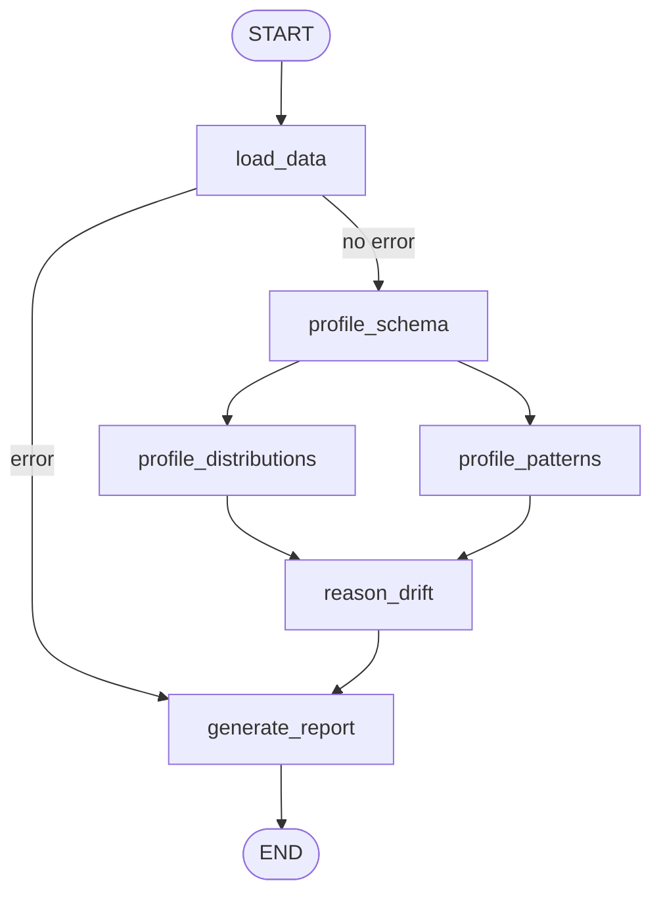

# LangGraph Drift Detection Framework

A LangGraph-based rebuild of the semantic schema and data drift detection pipeline. All state flows through a single `DriftState` TypedDict; each node is a pure function returning only the keys it modifies.

## Graph Topology



`profile_distributions` and `profile_patterns` run as a parallel fan-out from `profile_schema`. LangGraph's implicit barrier fires `reason_drift` only after **both** complete.

## Drift Types Detected

| Type | Category key | LLM? | Node |
|---|---|---|---|
| Column addition / removal | `schema_insights` | Yes | `profile_schema` |
| Data type change | `schema_insights` | No | `profile_schema` |
| Volume shift (>20%) | `schema_insights` | No | `load_data` |
| Numeric distribution | `distribution_insights` | Yes | `profile_distributions` |
| Cardinality change (>30%) | `distribution_insights` | No | `profile_distributions` |
| String pattern / format | `pattern_insights` | Yes | `profile_patterns` |
| Referential integrity | `pattern_insights` | No | `profile_patterns` |

## Usage

```bash
# From repo root (ensure .venv is active and OPENAI_API_KEY is set)
python langgraph_impl/cli.py \
  --reference data/reference_data.csv \
  --new data/new_data_with_drift.csv \
  --output drift_report.json
```

## Key Files

| File | Purpose |
|---|---|
| `state.py` | `DriftState` TypedDict — single source of truth |
| `graph.py` | `build_graph()` — StateGraph construction and compilation |
| `models.py` | `ColumnProfile`, `DriftInsight`, `DriftSummary` Pydantic models |
| `nodes/data_loader.py` | Load datasets + volume drift |
| `nodes/schema_profiler.py` | LLM column profiling + column drift + dtype drift |
| `nodes/distribution_profiler.py` | LLM distribution drift + cardinality drift |
| `nodes/pattern_profiler.py` | LLM pattern drift + referential integrity drift |
| `nodes/drift_reasoner.py` | LLM synthesis → `overall_severity` + `llm_summary` |
| `nodes/report_generator.py` | Serialize state to `drift_report.json` |
| `cli.py` | Entry point: argparse + graph invocation + summary print |

## State Flow

```
initial_state (cli.py)
    └─ load_data         → reference_df, new_df, schema_insights (volume), error
    └─ profile_schema    → column_profiles, schema_insights (+ column + dtype)
    ├─ profile_distributions → distribution_insights (numeric + cardinality)
    └─ profile_patterns      → pattern_insights (pattern + referential integrity)
    └─ reason_drift      → all_insights, overall_severity, llm_summary
    └─ generate_report   → report_path
```

## Design Notes

**No checkpointer:** `pd.DataFrame` objects in `reference_df`/`new_df` are not JSON-serializable. Do not pass a LangGraph `checkpointer` to `graph.compile()` without a custom DataFrame serializer.

**LLM calls:** All LLM instantiation goes through `llm_client.get_llm()`. New detectors should prefer deterministic checks and only add LLM calls for semantic interpretation.

**Extending:** To add a new drift detector, add logic inside the appropriate node and append `DriftInsight` objects to the matching list. No changes to `graph.py`, `state.py`, or `drift_reasoner.py` are needed — new insights flow automatically into `all_insights`.
